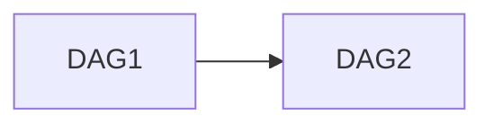

# heading 1

__bold__

*italic*

~~strike~~

Paragraph
, Continued

New line

<http://example.org>

[example](http://example.org)

[#heading 5](#heading-5)
[#Test Lists](#test-lists)
[#Heading-With Dash](#heading-with-dash)


## heading 2

## Test Lists

Ordered list:

1. First item
2. Second item
3. Third item
   1. Nested item 1
   2. Nested item 2
4. Fourth item

Unordered list:

* Item A
* Item B
  * Nested B1
  * Nested B2
    * Deep nested
* Item C

Check list:

* [ ] TODO1
* [ ] TODO2
* [x] DONE

Complex list

1. Order 1
    * Sub unorder 1
    - Sub unorder 2
2. Order 2

### heading 3

Table

|heading 1|heading 2|heading 3|
| --- | --- | --- |
|cell A1|cell A2|cell A3|
|cell B1|cell B2|cell B3|

| Feature | Pros | Cons |
|---|---|---|
| Markdown | __Simple__ | *Limited features*  |
| Confluence | Rich `formatting` ~~Tables~~ Macros | Proprietary Complex |

#### heading 4

> [!info] Info
> Call out

> [!warning] Warning
> Call out

> [!tip] Tip
> Call out

> [!note] Note
> Call out

##### heading 5

The graph.



###### Heading 6

### Heading-With Dash

1. Ordered list 1
2. Code block inside list

    ```sh
    echo 'hello'
    ```

3. List after code
